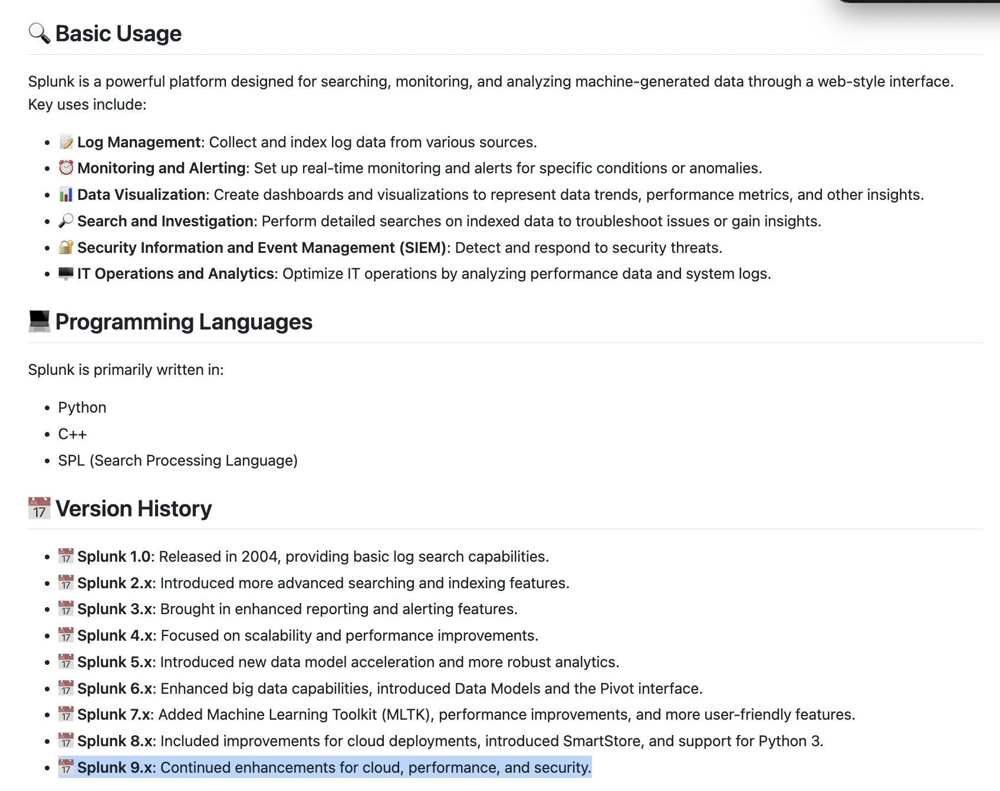
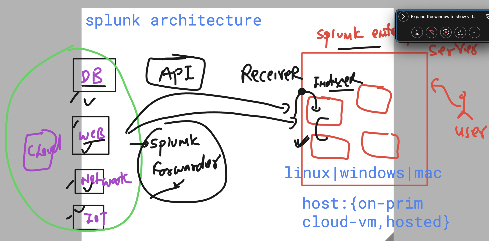
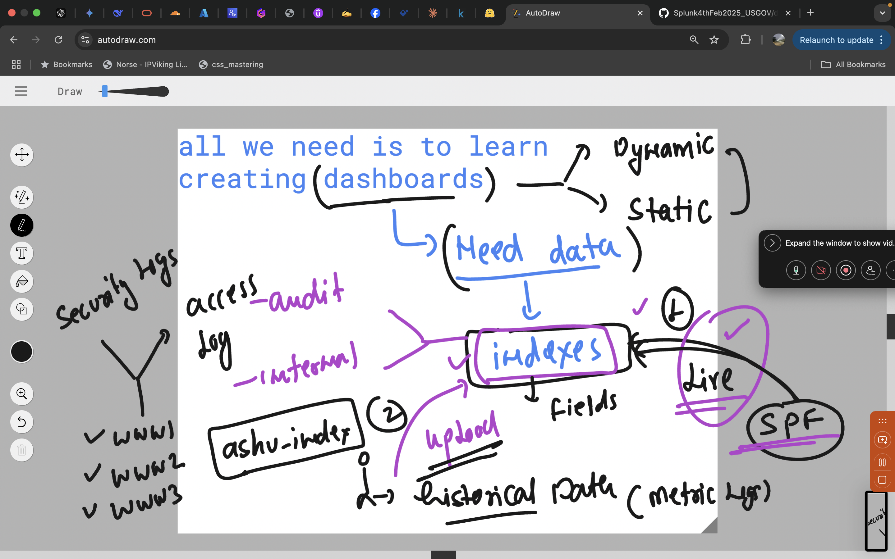
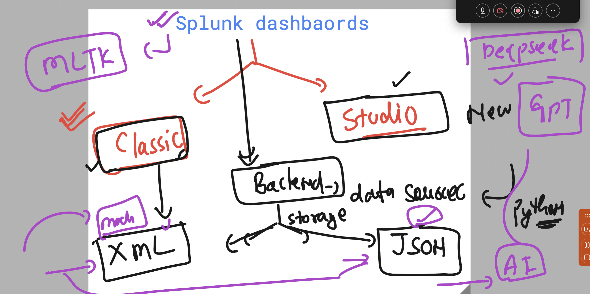

### Splunk Generic architecture 


### lab setup understanding 


### SPlunk indexing and data storage


### searching data in searchhead 


# Splunk Restart 

### some basic info you need to know 



## Splunk basic architecture 




### Splunk forwarder verify details 

### status 

```bash
/opt/splunkforwarder/bin/splunk status 
Warning: Attempting to revert the SPLUNK_HOME ownership
Warning: Executing "chown -R splunkfwd:splunkfwd /opt/splunkforwarder"
splunkd is running (PID: 784).
splunk helpers are running (PIDs: 1393).
[root@splunk-forwarder1 ~]# 

```

### checking Splunk Enterprise details 

```bash
/opt/splunkforwarder/bin/splunk list forward-server
Warning: Attempting to revert the SPLUNK_HOME ownership
Warning: Executing "chown -R splunkfwd:splunkfwd /opt/splunkforwarder"
Active forwards:
	10.160.0.2:9997
Configured but inactive forwards:
	None

```

### what is being monitored and forwarder by Splunk forwarder

```bash

 /opt/splunkforwarder/bin/splunk list monitor 
```

### creating Index and uploading data manually 



## Splunk dashboards 



