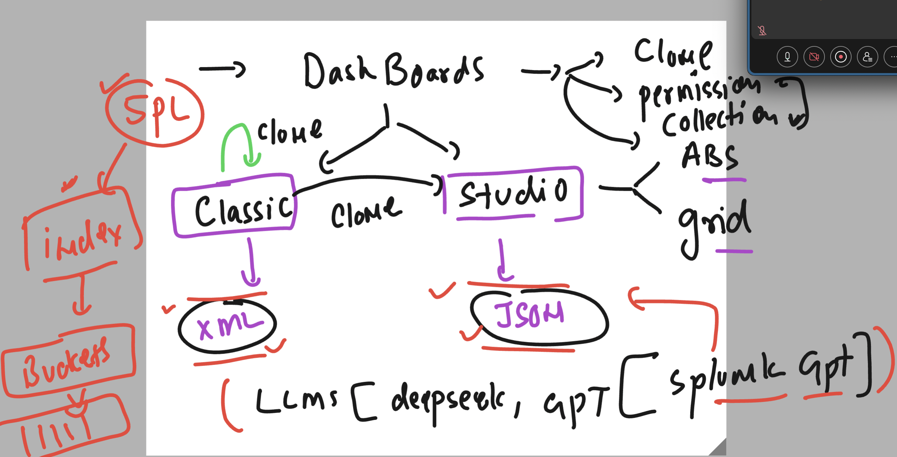

## Revision 



### adding log httpd to particular index 

```
 /opt/splunkforwarder/bin/splunk add monitor /var/log/httpd/ -index webapp_data  -sourcetype access_combined 
Warning: Attempting to revert the SPLUNK_HOME ownership
Warning: Executing "chown -R splunkfwd:splunkfwd /opt/splunkforwarder"
Your session is invalid.  Please login.
Splunk username: admin
Password: 
Added monitor of '/var/log/httpd'.
[root@splunk-forwarder1 ~]# 

```
